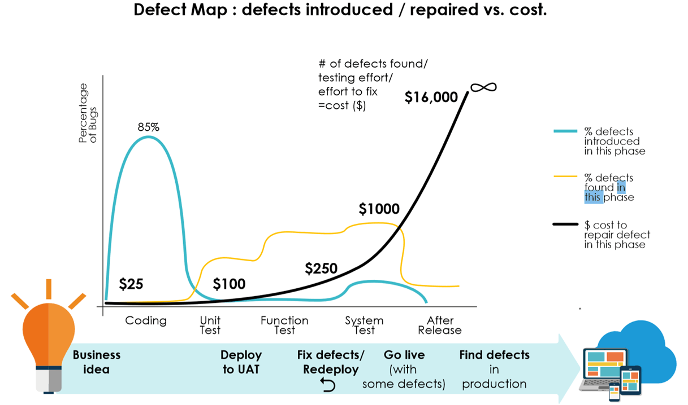

# Quality is a Full Team Effort

Yes we do have a dedicated Quality Assurance team, and they do a great job managing the quality process, but truly delivering quality software on a day to day basis requires a full team effort.

We all learnt in Software Engineering 101 the concept of the how the cost of a defect increases significantly through the software development lifecycle, the diagram below is a neat illustration of this. This concept is exacerbated in a waterfall style SDLC, but is still absolutely valid in an agile environment. The basic rule is that the more defects we can catch in either the requirements, design or initial implementation the better the outcome, and this is requires the whole team to have a quality focus at all stages of delivery.

# Quality from the Start

Building quality software starts with getting the requirements right. This doesn't mean a drawn out process of defining, documenting and approving requirements, but rather using a consistent language, and iterative approach to create a shared understanding amongst the team.

To achieve this we write our requirements as User Stories using the following standard format to keep a focus on business value:

> As a [role]
>
> I want [feature]
>
> So that [benefit]

A User Story is intended as a starting point for a conversation regarding a requirement. In order to define the story to the point of shared understanding and to sufficient detail to implement a software solution it is necessary to define Acceptance Criteria (AC). We use the gherkin format to document the Acceptance Criteria scenarios to ensure that each AC is a testable statement:

> Scenario 1: Title
>
> Given [context]
>
> And [some more context]...
>
> When  [event]
>
> Then  [outcome]
>
> And [another outcome]...

User Stories and Acceptance Criteria should be developed in an iterative manner with additional information added over time as more detail is discovered. The following guidelines are recommended to develop clear and concise requirements.

- The Product Manager should write initial high-level User Stories in the first instance to frame the problems to be solve.
- These Stories should not be solution statements, but focused on the outcomes - the Story Format will help with this.
- The initial attempt at writing the stories should include a first round of Acceptance Criteria.
- It's often best to keep these initial Stories and AC's as statements in a wiki page or Google Doc at this point.
- The first draft of Stories and AC's should be used as the key input to a collaborative design session with the Squad, including Designer, Engineers and QA. The purpose of this session is to get to a shared understanding of the problem to be solved and the challenges in solving it. The session will undoubtably include some solutioning given the audience, however the main intent is to flesh out the detail of the requirements, and split up the stories to the right level of granularity.
- Once the team is happy that they have another information to progress with design and implementation of the features, then they should be carded up in JIRA and prioritised for the team to deliver.

# Testing Testing and more Testing

Even software engineers make mistakes, and to ensure the quality of Production-ready software testing is required, the more critical the software the more testing that is required. As a software project grows, manual testing is not sufficient to maintain quality and speed of software delivery. Thankfully there are many options, frameworks and tools available to build the tests into code and automate their execution.

A good introductory article on the automation of software testing can be found on [Martin Fowler's Blog](https://martinfowler.com/articles/practical-test-pyramid.html).

Probably the most fundamental concept to understand when it comes to automation of testing is the Test Pyramid a concept introduced by Mike Cohn in his book [Succeeding with Agile](https://www.mountaingoatsoftware.com/books/succeeding-with-agile-software-development-using-scrum).

There is ongoing debate about the exact definitions and namings of the different levels or typs of testing, but fundamentally:

  1. Write tests with different granularity
  2. The more high-level you get the fewer tests you should have

The logic behind this is that the lower level tests are cheap to write, cheap to maintain and cheap to execute, where as top level tests (lets say functional acceptance tests), are difficult (expensive) to write, easily broken, and slow (expensive) to run. Therefore, some good guidelines are:

## Unit Tests

- Put the majority of effort into writing low level unit tests.
- Test the public interface of classes, not the implementation.
- Aim for as much unit test coverage as possible, but don't test trivial code, i.e. getters and setters.

## Integration Tests

- Write integration tests for every piece of code where you either serialise or deserialise data.
- Where possible run external dependencies locally for speed.

## Contract API Testing

Our platform is based on a number of REST-based microservices. Making sure that these services behave as expected and we are aware of the impact to any changes to the API's is crucial to maintain the stability of the system.
- Where ever possible implement **Consumer Driven Contract (CDC)** tests. See (https://martinfowler.com/articles/practical-test-pyramid.html#ContractTests) for a detailed description.
- Where CDC tests are not possible, i.e. public APIs, implement **Provider** tests.

## Functional UI or Acceptance Tests

End to End (E2E) tests driven from the user interface, are the ultimate functional or acceptance test. However, they are expensive to build and run, and notoriously flaky or brittle.
- Although E2E UI tests are important, try to keep them to a minimal set of tests with maximum effective coverage.
- Group E2E tests into separate pipelines so that they can be selectively executed to speed up the build and test time.
- Acceptance tests should be aligned directly with Acceptance Criteria. The gherkin format (Given.. When.. Then..) is important to facilitate this.

## Exploratory Testing

Even with thorough automation test coverage, certain issues will still slip through.
- Ideally manual testing is constrained to Exploratory Testing, an approach that emphasises the freedom of the tester to just use the application and try to break it.
- Exploratory testing can be undertaken by everyone in the team, QA Engineers, Designers, Product Managers and Engineers.

## Additional considerations

- Strive for simplicity and avoid duplication.
- Always push your tests as far down the pyramid as you can. If a higher-level test spots an error and there's no lower-level test failing, look at it to see how you can write a lower-level test to cover that scenario.
- Remove (delete) higher level tests that are covered by lower level tests, unless they provide extra value. Be ruthless with this.
- Write clean test code. Test code is as important as production code, give it the same level of care and attention.

# Peer Reviews and Quality

The Peer Review process serves lots of needs, one of the most important being a quality check. Peer review's should assess the following quality aspects, not all are strictly testing related:
- Does the Pull Request address the User Story and AC's?
- Is the code clean and will it make sense to a new Engineer? Would Uncle Bob approve?
- Is there the potential that this will have any unexpected impacts elsewhere within the system?
- Is the testing at the right level, i.e. is everything that can be tested at the unit level tested, and is there no duplication of testing?
- Is the implementation secure or has it introduced a vulnerability into the system?
- Are there any performance concerns relating to the implementation approach?

# Look Beyond the Immediate Change

Although reviews and approvers of a Pull Request should also be assessing the potential impact of the PR to the broader code base, the engineer responsible for writing the code is best placed to consider this. However, to do this it does force you to stop momentarily and look at your changes in a more holistic light. The key aim here is to avoid introducing regression defects during new feature development, and also during any refactor work.
- Consider if the code you're touching has the potential to change the behaviour of the system in an unexpected manner.
- Is there anything obvious such as "This is a common component". Check the usage of that component elsewhere to confirm you are not introducing any regressions.
- This is particularly important for changes to APIs, although CDC testing should help catch these issues.
- If your removing code, double check that it is not used anywhere.
- Based on your assessment, make sure you run the appropriate build plan of automated regression tests before merging to Master.
- Any if there is any query about whether there might be an impact, manually test the suspect parts of the system while in the Squad branch.

# The Deployment Pipeline

//TODO

- Quality thresholds build into the build pipeline.

# Monitor and Measure

Visual inspections of code, through peer reviews in the PR process, are important, however code quality tools such as SonarCloud and Gitlab's code quality provide a reliable mechanism to quantitatively and qualitatively monitor the quality of the code base. This includes measures such as test coverage, code complexity, security and more.
- All repositories are integrated with a code coverage tool such as SonarCloud or Codacy.
- All repositories are integrated have code scanning enabled, i.e. SonarCloud or GitHub code scanning.
- Metrics need to be agreed regarding acceptable quality thresholds and monitored using these tools.

The ultimate measure of quality is the number of defects, that is both the number of defects in Production and the number of defects identified through the SDLC. To monitor the effectiveness of our QA Culture we have identified a number of metrics and reports that allow us measure our progress:
- Number of defects in the Production system - both Total number and by system or micro-service.
- Total number of defects introduced every month by system or micro-service
- Number of regression defects introduced every month by system or micro-service
